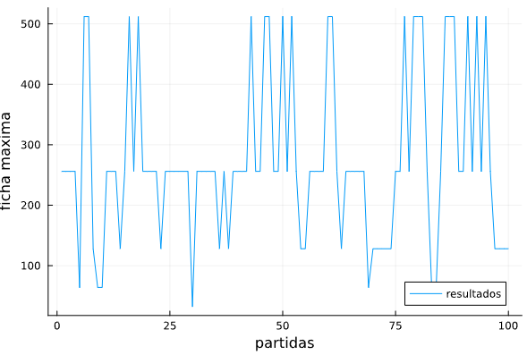

# Agente 2048 - Learning
## Introducción

Se va a intentar resolver el juego 2048 utilizando el método de Q-Learning utilizando el lenguaje de programación JULIA.

## Desarrollo
El desarrollo consiste en tres partes diferenciadas

### 2048.jl
Donde se modela el entorno, la interacción con las distintas acciones y el calculo de las recompensas.

### Learning.jl
La algoritmia relacionada con el aprendizaje, se ha quedado en un estado en el cual solo se mira un paso hacia adelante y no se tiene en cuenta más que las recompensas obtenidas en la acción siguiente. Es decir, no estamos aplicando Q-Learning ni SARSA, tan solo una heurística basada en escoger la acción con mayor recompensa.

### Fichero principal.jl
Configuración de parámetros y ejecución de las distintas partidas del juego donde por cada partida, la Q_tabla se mantiene.

## Modelado de recompensas
Se puntua positivamente:
* Que las fichas de mayor valor se mueva hacia las esquinas.
* Que las ficha de mayor valor se mantengan en la esquina.
* La fusión de fichas.

Se penaliza:
* Mover la ficha de mayor valor que se encuentra en una esquina hacia dentro.
* Hacer un movimiento no permitido.

## Conclusiones
* La tabla Q tiene un crecimiento exponencial con respecto al tamaño del tablero y lineal con respecto al número de partidas jugadas.
* Sería interesante explorar el uso de redes neuronales para aproximar la función Q.
* No he sido capaz de resolver el juego, ni a mano ni utilizando el agente, por lo que no tengo mucho más que añadir.

## Graficos

